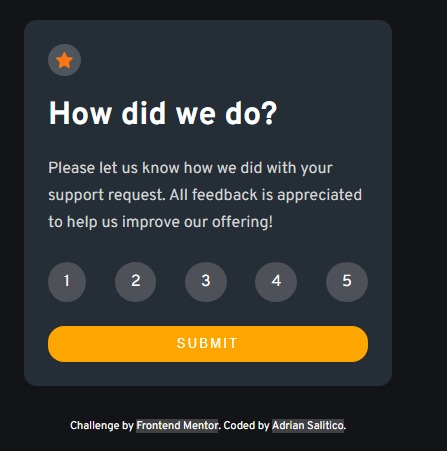
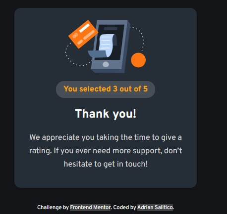
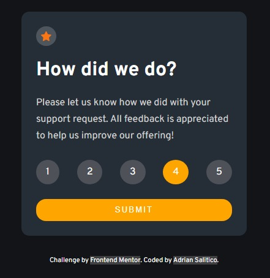

# Frontend Mentor - Interactive rating component solution

This is a solution to the [Interactive rating component challenge on Frontend Mentor](https://www.frontendmentor.io/challenges/interactive-rating-component-koxpeBUmI). Frontend Mentor challenges help you improve your coding skills by building realistic projects.

## Table of contents

- [Overview](#overview)
  - [The challenge](#the-challenge)
  - [Screenshot](#screenshot)
  - [Links](#links)
- [My process](#my-process)
  - [Built with](#built-with)
  - [What I learned](#what-i-learned)
  - [Continued development](#continued-development)
  - [Useful resources](#useful-resources)
- [Author](#author)
- [Acknowledgments](#acknowledgments)

## Overview

### The challenge

Users should be able to:

- View the optimal layout for the app depending on their device's screen size
- See hover states for all interactive elements on the page
- Select and submit a number rating
- See the "Thank you" card state after submitting a rating

### Screenshot

#### Mobile & Desktop Design





### Links

- Solution URL: [Repository](https://github.com/Frogerall/interactive-rate-card)
- Live Site URL: [Live Site](https://frogerall.github.io/interactive-rate-card/)

## My process

### Built with

- Semantic HTML5 markup
- CSS custom properties
- Flexbox
- CSS Media Query
- Saas/Scss for css extension
- Javascript for Interactivity

### What I learned

```js
for (let i = 0; i < rateItems.length; i++) {
 if (rateItems[i].classList.contains("active")) {
  rateValue = rateItems[i].textContent;
  rateResult.textContent = rateValue;
  rateCount++;
 }
}
if (rateCount > 1) {
 alert("Select 1 only.");
} else if (!rateValue) {
 alert("Please select ratings");
} else {
 resultPage.classList.add("result");
 resultRate.classList.add("open");
}
```

If you want more help with writing markdown, we'd recommend checking out [The Markdown Guide](https://www.markdownguide.org/) to learn more.

## Author

- Website - [Adrian Salitico](http://salproj.tech)
- Frontend Mentor - [@frogerall](https://www.frontendmentor.io/profile/frogerall)
- Twitter - [@saliticoadrian](https://www.twitter.com/saliticoadrian)

## Acknowledgments

This is where you can give a hat tip to anyone who helped you out on this project. Perhaps you worked in a team or got some inspiration from someone else's solution. This is the perfect place to give them some credit.
